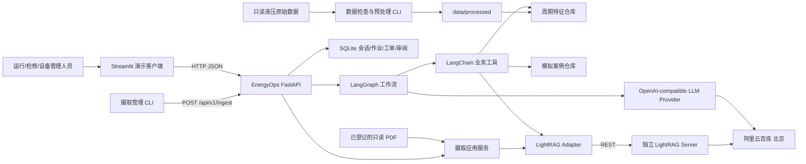
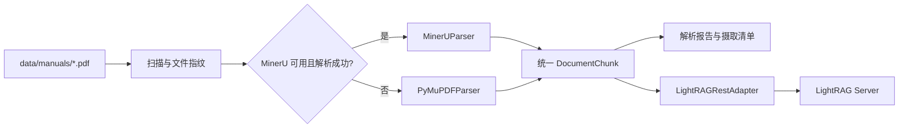
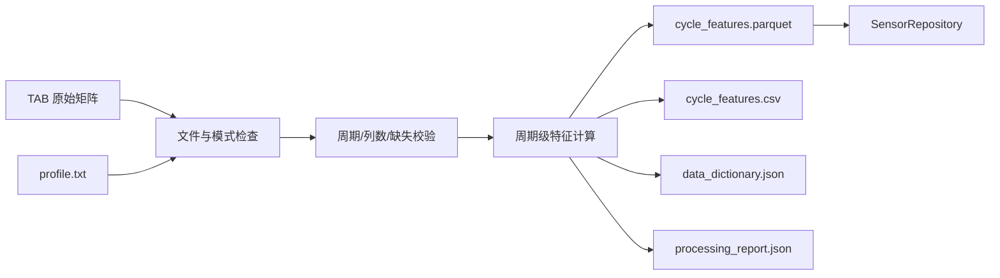
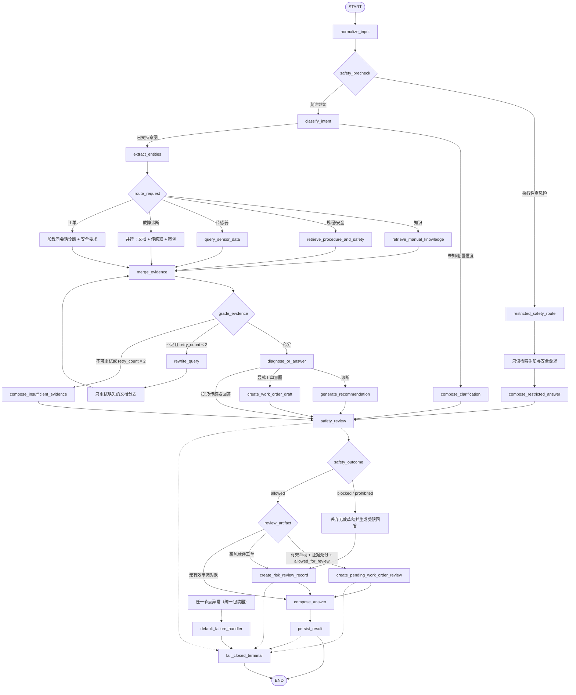

# EnergyOps Copilot 架构设计

> 状态：已确认，允许开发
>
> 版本：0.2
>
> 日期：2026-07-21

## 1. 架构目标

设计需要同时满足：

- 用有限组件完成可演示的端到端工业 Agent。
- 隔离模型、LightRAG、业务 API、前端与数据处理职责。
- 保证所有诊断结论可追溯到文档或数据证据。
- 默认安全失败，任何审批都不触发真实设备动作。
- 离线测试不依赖模型密钥，真实集成可单独 Smoke 验证。
- 保留向生产部署演进的服务边界，但不提前建设大型微服务体系。

## 2. 方案比较

| 方案 | 优点 | 主要问题 | 结论 |
|---|---|---|---|
| 单进程：FastAPI 内嵌 LightRAG 和 UI 逻辑 | 启动最少、开发最快 | 索引与查询故障影响业务 API；边界模糊；不利于独立扩展 | 不采用 |
| 模块化单体业务后端 + 独立 LightRAG REST + Streamlit 客户端 | 服务边界清楚；仍可单机运行；便于测试和迁移 | 比单进程多一个服务和健康检查 | 采用 |
| 完整微服务：路由、诊断、数据、工单、审批分别部署 | 隔离和独立扩展能力最强 | 运维、网络、鉴权和一致性成本远超 MVP | 不采用 |

## 3. 系统上下文



## 4. 进程与部署边界

MVP 运行四类进程或外部服务：

1. **EnergyOps FastAPI**：唯一业务 API，承载 Agent、工具编排、安全审查和持久化。
2. **LightRAG Server**：独立进程，通过 REST 提供导入、查询、来源和健康检查。
3. **Streamlit**：纯 API 客户端，只负责展示和用户输入。
4. **阿里云百炼**：北京地域的外部 Chat 和 Embedding 服务。

SQLite 和本地处理文件属于业务后端的数据层，不由 Streamlit 直接访问。

本地演示默认只绑定 `127.0.0.1`。LightRAG 仅在内部网络或回环地址暴露，`data/raw_dataset` 和 `data/manuals` 以只读方式提供给处理作业，LightRAG 索引目录只能由 LightRAG 服务写入。SQLite MVP 只运行一个 FastAPI 写入 worker；启用 WAL 和 busy timeout，水平扩展前必须迁移 PostgreSQL。

LightRAG Server 的服务边界已经确定；具体启动命令、官方镜像或 Python 包入口必须在开发阶段先锁定版本并运行最小官方 Smoke Test 后决定。不得凭历史版本猜测 CLI、端点或请求字段。若官方容器路径验证通过，可用 Docker Compose 启动；否则以独立 Python 3.11 进程运行，但 REST 契约和业务适配器保持不变。

## 5. 源码模块边界

建议的 `src` 布局：

```text
src/industrial_energy_agent/
├── api/              # FastAPI 应用、依赖与路由
├── agents/           # 状态、提示词、意图、诊断、决策与安全代理
├── workflow/         # LangGraph 图、节点和条件路由
├── rag/              # RAG 抽象、REST 适配器、解析、导入和引用
├── tools/            # LangChain 业务工具
├── data_processing/  # 液压加载、校验、特征和模拟数据
├── domain/           # 领域模型、枚举和安全规则
├── persistence/      # SQLite 数据库和仓库
├── providers/        # OpenAI-compatible Chat/Embedding Provider
├── evaluation/       # 评估器与指标
├── config/           # Pydantic Settings
├── cli.py
└── logging_config.py
```

边界规则：

- `domain` 不依赖 FastAPI、Streamlit、LightRAG 或阿里云 SDK。
- `workflow` 只通过工具和接口访问外部资源。
- `rag` 隐藏所有 LightRAG 版本差异。
- `providers` 隐藏百炼的 Base URL、认证和模型参数差异。
- `api` 只负责协议转换、依赖注入和统一错误响应。
- `app/streamlit_app.py` 只通过 HTTP 调用 API。
- `/api/v1/ingest` 和 `/api/v1/approvals/*` 使用最小服务令牌、严格 CORS 和本地绑定；摄取只接受已登记文档 ID，不接受任意 URL 或任意本机路径。
- 管理 CLI 和脚本只能调用 `/api/v1/ingest`，或在进程内复用同一个摄取应用服务；禁止绕过登记、幂等作业和审计逻辑直连 LightRAG Server。

## 6. 外部接口抽象

### 6.1 LLM Provider

Provider 使用 OpenAI-compatible 协议，配置项至少包括：

- `LLM_API_KEY`，运行时可回退读取 `DASHSCOPE_API_KEY`，但不复制密钥。
- `LLM_BASE_URL`；推荐显式配置北京业务空间专属地址。
- `CHAT_MODEL=qwen3.7-plus`。
- `EMBEDDING_MODEL=text-embedding-v4`。
- `EMBEDDING_DIMENSION=1024`。
- 超时、最大重试、并发和 Token 限制。

北京业务空间专属地址模板：

```text
https://{WorkspaceId}.cn-beijing.maas.aliyuncs.com/compatible-mode/v1
```

配置优先级固定为：显式 `LLM_BASE_URL` → 北京共享 OpenAI-compatible 端点 `https://dashscope.aliyuncs.com/compatible-mode/v1`。业务空间专属地址是接近生产环境的推荐方案；未配置 WorkspaceId 时允许使用共享端点完成 MVP，不得拼造专属地址。启动时只校验地址协议、地域约束和可达性，不记录可能包含租户标识的完整 URL。

`WorkspaceId`（如使用专属地址）和密钥只来自环境变量。日志不得输出完整 URL 中可能携带的敏感租户信息、Authorization Header 或密钥。

官方能力基线（2026-07-21 核查）确认 `qwen3.7-plus` 支持文本、图像、视频和 Function Calling，但 MVP 只启用文本与工具调用，视觉输入仍为 Deferred。结构化节点固定使用非思考模式的 JSON Mode（`response_format={"type":"json_object"}`），提示词显式要求 JSON，并用 Pydantic 做二次 schema 校验；不能把 JSON Mode 宣称为严格 JSON Schema。模型结构化输出非法时执行有限重试，仍失败则进入规则回退或 `unknown`，不得直接信任原始文本。

Embedding Provider 使用 OpenAI-compatible 的复数参数 `dimensions=1024` 和 `encoding_format="float"`，并断言响应向量长度为 1024；不得把 DashScope 原生接口的 `dimension`、`text_type` 或 `instruct` 参数混入兼容接口。

### 6.2 RAG Adapter

业务层使用稳定接口，不直接依赖 LightRAG SDK：

```text
ingest_documents(documents, options) -> IngestResult
search(query, mode, top_k, local_filters=None) -> SearchResult
health_check() -> HealthStatus
get_sources(source_ids) -> list[CitationSource]
```

实现包括：

- `LightRAGRestAdapter`：真实运行时使用。
- `FakeRAGAdapter`：单元和离线集成测试使用。

开发目标版本为 `lightrag-hku[api]==1.5.4`，仍以本机安装 Smoke 为最终锁定门。查询优先使用 `POST /query/data` 获取未经过 LightRAG 二次生成的实体、关系、块和 references；导入使用 `POST /documents/text(s)` 并轮询 `GET /documents/track_status/{track_id}`。1.5.4 没有独立 sources endpoint、客户端自定义 document ID、幂等 upsert、任意 metadata 字段或查询 filters，因此 `get_sources` 和设备类型过滤必须由本地摄取清单完成。`local_filters` 只允许在响应映射后依据本地清单执行后过滤，绝不传给 LightRAG，也不能伪装为服务端已下推过滤。

适配器负责：

- REST 请求/响应映射。
- `local`、`global`、`hybrid`/`mix`、`naive` 模式映射。
- 超时、有限重试、健康检查和错误归一化。
- 将 LightRAG 返回来源转换为项目统一引用模型。
- 明确区分无结果、服务不可用、请求无效和上游限流。

## 7. 文档处理架构



统一 `DocumentParser` 接口返回 `DocumentChunk` 列表和解析报告。每个块保留文件、标题、页码、章节、块 ID、文档类型、设备类型、`parser_name`、`parser_version`、`source_sha256`、`limitations` 和 `extraction_warnings`；无内容的可选值也要显式使用 `null` 或空列表，不能省略字段。

页码是从 1 开始的物理 PDF 页，块不跨页。稳定 ID 格式为 `<doc_id>:p<page>:c<ordinal>:<normalized_text_sha256_8>`；相同源文件、解析器/分块版本和文本必须生成相同 ID。

摄取采用唯一的幂等应用服务：管理 CLI 调用 `/api/v1/ingest`，API 根据已登记文档、内容哈希和处理指纹创建 SQLite 作业并返回 `202 + job_id`，单进程作业消费者完成解析并经 `LightRAGRestAdapter` 导入。MVP 不引入 Redis 或 Celery。本地重复幂等键复用同一作业；分块配置、解析器版本或 Embedding 指纹变化时使用新索引命名空间。

摄取作业状态固定为 `PENDING | RUNNING | SUCCEEDED | FAILED | RECONCILE_REQUIRED`。消费者原子领取 `PENDING` 作业并写入 `lease_expires_at`，运行中定期续租；进程启动时继续处理 `PENDING`，并回收租约已过期的 `RUNNING`。领取和最终提交均校验幂等键与租约所有者，使用有限 `attempt_count` 和脱敏 `last_error`，防止重启后永久卡住或本地并发领取。

SQLite 租约不能把远程 REST 副作用变成原子事务。业务侧必须从 `source_sha256 + processing_fingerprint` 生成确定性的 `remote_document_id`，并把它编码到全局唯一的 LightRAG `file_source` basename 和导入文本头；该 ID 只属于本地摄取清单，因为 1.5.4 不接受客户端 document ID，也没有幂等 upsert 或按路径直接 GET。租约过期且已开始远程调用的作业必须先结合 track 状态、文档分页和 reference 往返执行远端对账：确认目标版本已存在则本地提交 `SUCCEEDED`；确认不存在且尝试次数未耗尽才可重试；无法可靠判断时进入 `RECONCILE_REQUIRED`，禁止自动重放和重复收费式导入。设计不宣称跨 SQLite 与 LightRAG 的“恰好一次”事务保证。

降级规则：

- 仅在 MinerU 不可用或明确失败时切换 PyMuPDF。
- 不因为个别表格解析失败而伪造内容。
- 使用 PyMuPDF 时仍必须保留页码和尽可能可靠的章节上下文。
- 解析器选择、失败原因和受影响页写入报告。
- PDF 和检索文本均视为不可信数据，文档内的指令不得改变系统规则、工具权限或安全路由。

## 8. 液压数据架构



处理约束：

- 原始目录只读，不覆盖、不删除、不在原地生成临时文件。
- 周期 ID 使用 1 基编号与用户示例保持一致，内部读写必须显式转换，防止第 1200 周期出现偏移错误。
- 所有传感器周期数必须与 `profile.txt` 一致；不一致时处理失败并报告文件。
- 每周期输出 170 个特征、5 个标签和 `cycle_id`，共 176 列。
- `std` 使用 `ddof=0`，`trend=last-first`，`slope` 使用真实秒时间轴的一元最小二乘斜率；测试覆盖常量、短序列和异常输入。
- 特征列采用稳定命名，如 `PS1__mean`、`TS1__slope`。
- 不做隐式插值；非数值、非有限值、短行、长行或周期不一致会使处理失败并定位文件、周期和列。
- 查询只读 Parquet/仓库的周期级数据，不加载全部高频矩阵到 API 请求生命周期。

## 9. AgentState

`AgentState` 至少包含：

```text
user_query
request_id
conversation_id
normalized_query
retrieval_query
query_history
intent
intent_confidence
action_mode
extracted_entities
equipment
sensor_cycle_ids
retrieved_documents
sensor_evidence
fault_case_evidence
candidate_causes
recommendation_draft
safety_risk
risk_level
restricted_mode
citations
answer
retry_count
approval_required
approval_id
approval_status
work_order_draft
trace
evidence_grade
workflow_status
errors
```

关键领域模型均使用 Pydantic v2，禁止在节点之间传递无约束字典。

## 10. LangGraph 工作流



工作流规则：

- `user_query` 不可变；查询改写只改变 `retrieval_query`，不能清除原始风险语义、周期号或设备身份。
- 分类失败时使用有限规则回退；仍不确定时进入内部 `unknown` 路由并澄清，不默认伪装为设备问答。
- 高风险受限路由只能调用只读手册和安全要求工具，随后直接生成受限回答并进行最终安全审查；禁止进入普通证据融合、故障诊断或建议生成节点。
- 文档与传感器可并行，但合并节点必须等待所有已启动分支形成成功或错误结果。
- 每次语义改写增加 `retry_count`，最大值为 2；初始查询不计入，因此文档检索总轮数最多三轮。
- 空改写、重复改写或没有新增证据时提前停止。HTTP 重试与语义改写分别计数。
- 周期不存在、上游不可用、缺少先前诊断或引用 metadata 损坏时不进行无意义查询改写。
- 证据不足时明确拒答或给出需要补充的信息，不生成无来源结论。
- 工单只读取同一 `conversation_id` 的最近诊断；不存在时要求先诊断，不自行编造。
- 只有主意图明确为 `work_order_draft` 时才能调用 `create_work_order_draft`。创建工单审阅记录还必须同时满足：草稿对象实际存在且通过 schema、前置诊断与证据充分、`safety_outcome=allowed_for_review`。任一条件失败都不创建工单审阅 ID。
- `prohibited_bypass`、安全审查失败或草稿包含禁止内容时，必须清空 `work_order_draft`/草稿引用并返回受限回答；如需留痕，只创建风险审阅记录。高风险但未请求工单的输入也只创建风险审阅记录，不得自动生成工单。
- 故障诊断必须使用用户显式提供的周期，或同一 `conversation_id` 中已选中的周期。主演示先选择第 1200 周期，再在同一会话提交异常描述；若没有周期上下文，只能追问，或明确降级为不含传感器证据的定性分析，绝不自动挑选任意周期。
- 每个节点追加简洁 Trace：节点、动作、状态、耗时、来源数量和错误摘要；不包含隐藏思维链或密钥。
- 图中所有节点均由统一异常包装器覆盖，包括安全预检查、受限检索、实体提取、各工具、查询改写、建议/草稿、审阅和持久化节点。`default_failure_handler` 只做错误归一化并进入确定性的 `fail_closed_terminal`。
- `fail_closed_terminal` 不再次调用 LLM、工具、`safety_review` 或持久化依赖；它只返回最小安全响应、`approval_required=true`、原 `request_id` 和脱敏错误码。审阅/持久化失败时不得返回伪造的审阅 ID、工单 ID 或成功状态。

## 11. 证据与引用

统一引用模型：

```text
Citation
- citation_id
- source_type: manual | sensor | synthetic_case
- source_file
- document_title
- page_number
- section_title
- chunk_id
- dataset
- cycle_id
- artifact_version
- features
- units
- entity_id
- case_id
- excerpt
- data_type
```

该模型使用 `source_type` 作为判别字段：手册引用要求 `document_title`、物理 `page_number` 和 `chunk_id`；传感器引用要求 `dataset`、`cycle_id`、`artifact_version`、所用特征及单位；模拟引用要求稳定的 `entity_id` 或 `case_id`，并强制 `data_type=synthetic_demo`。不适用字段为 `null`，不能用其他来源字段冒充。

规则：

- 文档回答至少包含一个可解析引用；无可靠引用时不得伪装为有据回答。
- 最终引用由后端反查摄取清单验证，不直接信任模型生成的文档名、页码或块 ID。
- 传感器证据引用周期 ID、传感器/特征和值。
- 用户自行描述的“压力下降、振动增加”标记为 `user_observation`，不得伪装成已查询数据。
- 模拟案例引用必须带 `data_type=synthetic_demo`。
- 引用格式化与去重由 `rag/citations.py` 统一完成。
- 文档结论与模型推断在回答中分区展示。
- 两份手册属于不同泵型；设备型号不明确时分别展示差异，禁止合并为单一确定规程。
- UCI 实验台数据与手册设备不是同一资产，所有融合回答必须明确其演示性质。

## 12. 故障诊断模型

诊断输出至少包含：

- 观察到的异常。
- 文档证据。
- 传感器证据。
- 候选原因及排序分数。
- 建议检查顺序。
- 风险等级和审批要求。
- 证据不足或数据局限。

排序分数只用于展示相对优先级，字段名和文案不得使用“真实故障概率”或“工业验证概率”。

## 13. 安全架构

安全审查使用“确定性规则优先、模型补充解释”的组合：

1. 工具调用前使用关键词、动作语气和对象规则执行安全预检查。
2. 领域规则根据操作对象和动作提升风险等级。
3. LLM 可解释风险和引用规程，但不能降低确定性规则给出的风险。
4. 回答返回前再次检查具体步骤、工单和禁止绕过内容。
5. `operation_command` 强制受限回答和 `approval_required=true`。
6. `prohibited_bypass` 在任何审阅状态下都拒绝，不提供绕过方法。
7. 所有工单固定为 `DRAFT`、`PENDING_REVIEW`、`executed=false`。
8. 审阅接口只允许审阅记录从 `PENDING_REVIEW` 变为 `REVIEWED` 或 `REJECTED`。工单审阅仅更新草稿的 `approval_status`，风险审阅仅记录人工决定；两者都不解锁内容、不改变 `executed=false`、不调用外部控制接口。
9. 高风险非工单请求只保存风险审阅记录；只有显式 `work_order_draft` 才能创建工单草稿及其审阅记录。

如果安全审查自身失败，系统按高风险处理并要求人工确认。

## 14. 持久化

SQLite 保存：

- 会话与请求摘要。
- Agent Trace 摘要。
- 摄取清单、内容哈希、索引指纹和摄取作业。
- 工单草稿。
- `work_order_review`：`review_id`、`work_order_id`、`request_id`、状态、决定、时间、操作者标识和幂等键。
- `risk_review`：`review_id`、`request_id`、`conversation_id`、风险类别、受限回答哈希、状态、决定、时间、操作者标识和幂等键；不得包含伪造的 `work_order_id`。

不保存：

- API Key。
- Authorization Header。
- 原始高频传感器数组。
- 隐藏思维链。

仓库接口隐藏 SQLite 实现，为未来迁移 PostgreSQL 保留边界，但 MVP 不同时实现第二种数据库。

两类审阅记录都只允许 `PENDING_REVIEW → REVIEWED | REJECTED`。审批 API 按 `review_type` 加载并校验目标：工单审阅只更新对应草稿的 `approval_status`，风险审阅只记录决定；两者都不能改变工单 `DRAFT`/`executed=false` 约束，也没有通往设备执行的边。

摄取作业仓库必须支持租约式领取、续租、过期 `RUNNING` 回收、启动恢复和远端对账。`SUCCEEDED` 作业按幂等键永久去重；`FAILED` 只有在显式重试且未超过最大尝试次数时回到 `PENDING`；`RECONCILE_REQUIRED` 必须由对账命令或人工确认解除，普通 worker 不自动重放。

## 15. 错误处理

统一错误结构至少包含：

```text
error.code
error.message
error.retryable
error.request_id
```

主要策略：

- 输入错误：返回 4xx 和字段级信息。
- 周期不存在：返回明确的 404，不回退到相邻周期。
- LightRAG 不可用：返回可重试的上游错误；若传感器证据可用，可生成明确标注的部分结果。
- 百炼限流/超时：指数退避和有限重试；达到上限后停止，不重复收费式无限调用。
- 解析失败：保留报告；MinerU 失败后只允许一次 PyMuPDF 降级。
- 数据证据与文档冲突：同时展示冲突并要求人工判断，不让模型自行消解为“确定事实”。
- 未知异常：服务端记录脱敏日志，客户端不显示堆栈。

## 16. 测试架构

### 单元测试

- 数据加载、模式校验和特征计算。
- 文档元数据与引用格式。
- 六个工具的成功、空结果和异常分支。
- 意图路由、实体提取和安全规则。
- 工单模型和仓库。

### 离线集成测试

- Fake LLM + Fake RAG 运行完整 LangGraph。
- 查询改写达到两次后停止。
- 高风险请求强制审批。
- FastAPI 使用临时 SQLite 和测试依赖覆盖。

### 真实 Smoke Test

- 百炼 Chat 最小调用。
- 百炼 Embedding 最小调用并校验 1024 维。
- 锁定版本的 LightRAG Server 健康检查。
- 小批文档导入和一次真实查询。
- 完整导入前统计分块和预计调用量。

## 17. 可观测性

- 结构化日志包含请求 ID、会话 ID、节点、耗时和状态。
- 对模型和 LightRAG 记录调用次数、延迟、重试和 Token/文档块数量，但不记录密钥。
- Langfuse 仅在环境变量完整配置时启用，缺少配置不影响系统启动。
- `/health` 区分进程存活与依赖状态；详细依赖信息放在 `/api/v1/system/info`，不得暴露密钥。

## 18. 演进边界

MVP 后可以替换：

- Streamlit → React/Vue。
- SQLite → PostgreSQL。
- 本地多进程 → 容器或远程服务。
- 百炼 Provider → 其他 OpenAI-compatible Provider。
- MinerU/PyMuPDF 的具体实现和版本可以升级，但 `DocumentParser` 与引用契约保持不变。

这些替换均依赖当前接口边界，不在 MVP 中重复实现。
